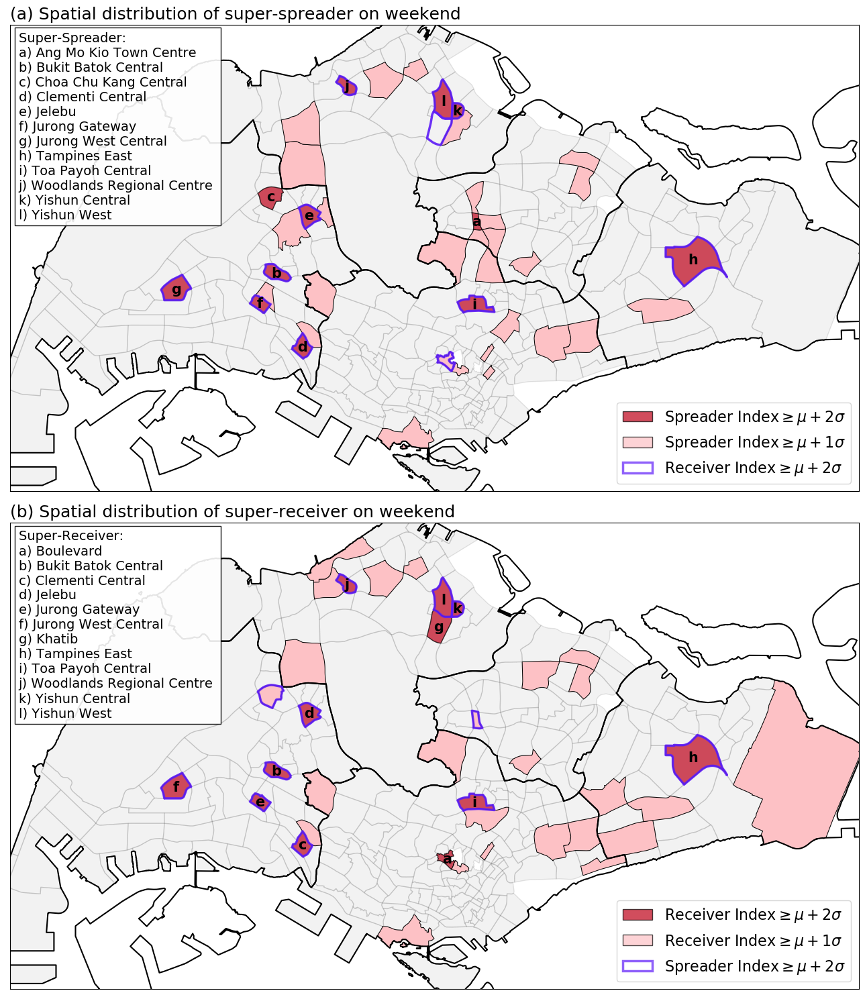
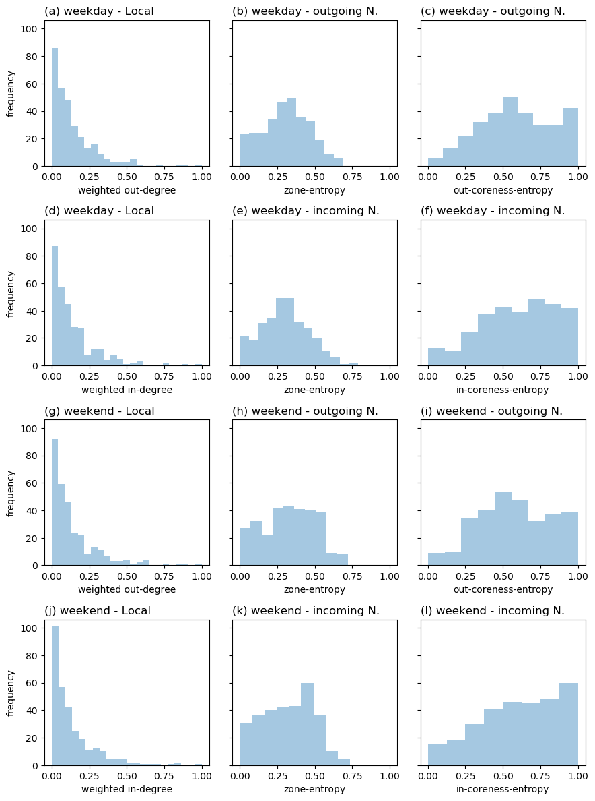
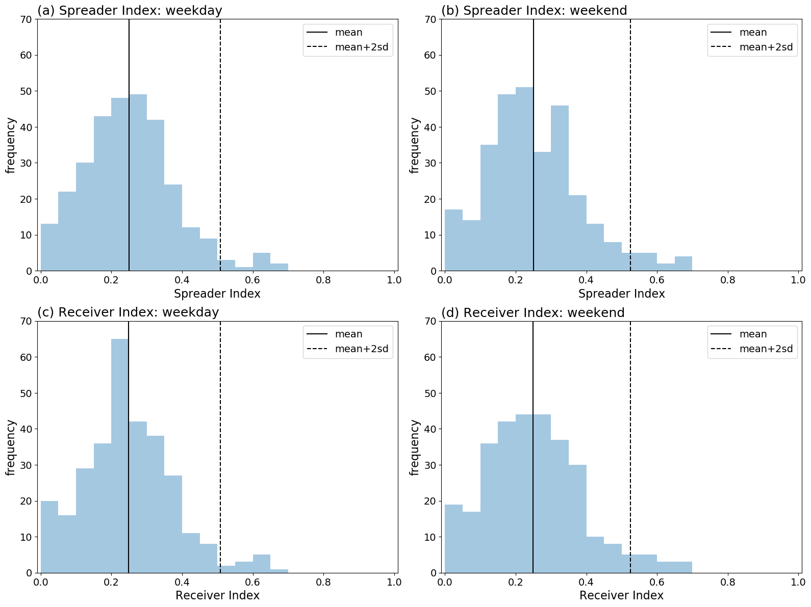
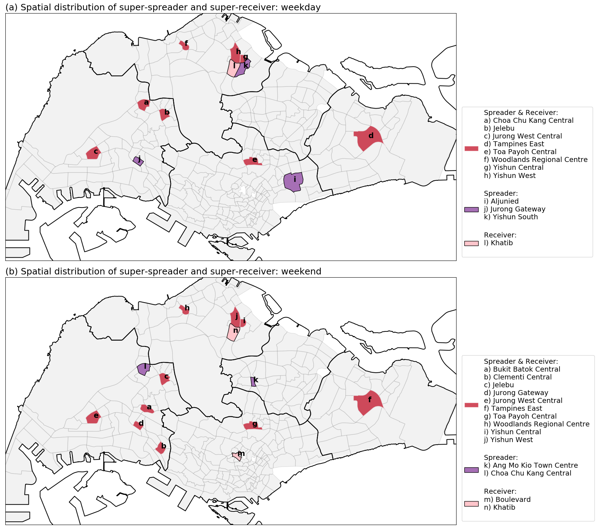

## Identifying spatial super-spreader and super-receiver from commuting network in Singapore. 

## Highlights

1. The aim of this study is to identify spatial super-spreader and super-receiver from commuting network (public transport flow).
2. Spatial super spreader is the subzones that have stronger ability to spread the disease to the rest of the country in a short time period, i.e. the potential source of outbreak.
3. Spatial super receiver is the subzones that are easily get influences by other places, i.e. the vulnerable places. 
4. Technically, the spreader/receiver index are the integration of the density (local degree centralities),  and the diversity of the outgoing/incoming links, in terms of varying zones and coreness (e.g. city cores and peripheries). 
5. The deliverable results are the distribution of the super-spreader and super-receiver subzones. 
6. In discussion, the results could be used to suggest the spatially allocation of medical resources and to provide advises for disease control. 

## Introduction

When a new infectious disease strikes a country or a city, the local public health sector authority would need to prevent the spreading of the disease and contain the outbreak situation. A infectious disease which could transmit from human to human, its spreading happens when people closely interact with one another, therefore the people are advise to not oppose themselves in a public space with high density of people, and not to attend or held activities with a large amount of people. 

But, before reaching the city/country lock-down condition, the peoples are still need to go to work or school as usual. In other words, the commuting process would happen as usual. When the commuting process is still working, it indicates the interactions between people would happens and if there is some unidentified patients or infected but asymptomatic persons in the crowds, the spreading of the disease may still occur. In most cases, the government authorities would try to control the disease situation by monitoring the health-care system (sick person is advised to go to doctors) and monitoring the incoming travelers from the airports or checkpoints. From the perspective of spatial governance, it is also important to knows that which part of the city is more vulnerable or has the capability to spread the disease in a short time period; those places should get more attentions in terms of local monitoring and resource allocations. 

The commuting flow of a city is a network representation of people flow in a city. A commuting flow network connect two places with a number indicating the number of people move from the origin to the destination. It could be used to capture the flow of people between places, and also the location where the interaction of people occurs. Therefore, the commuting flow network could be used to identify the places that are more dangerous in terms of spreading disease, namely super-spreader; and the vulnerable places that is easier to get infected, namely super-receiver. 

The aim of this study is to identify the super-spreader and super-receiver in a commuting network. A spatial super-spreader is a location where a lot of people are moving from, and those people are moving to different places; a spatial super-receiver is the destination of a large number of commuters, who come from different places. In other words, there is two keys to identify super-spreader and super-receiver, which is local density and neighborhood diversity (REF). The local densities  of a location are the number of people leaving from or reaching to the location. The neighborhood diversities contains two type of diversity, one of which is the diversity of zones, i.e. are the people come from different parts of the country; another is the diversity of coreness, i.e. are the people come from different types of the country in terms of core or peripheral areas. 

In this study, we present the analysis of Singapore public transport flow network, and identify the spatial super-spreaders and super-receivers using the spreader and receiver indexes, which were calculated based on the local densities and neighborhood diversities measurements. The population flow pattern may be different for weekday and weekend. Thus, the flow data were separated into two parts, weekday and weekend, to show the differences of super-spreaders and super receivers during weekdays and weekends. 

## Methods

The section contain three parts: (a) brief description of the study area, (b) the flow data, and (c) the four steps calculation of the spreader-index and receiver index. 

### Study area

This study focused on the Singapore commuting network flow in Singapore, using the subzone level spatial boundaries (from Master Plan 2014) as the analysis unit. The residential population density (from General Household Survey 2015) were shown in Figure 1. There were five regions (Central, West, North, North East, and East), 55 planning areas, and 323 subzones. Some of the subzones contain no residential population (white areas), which includes airports and airbases (e.g. Changi Airport at the East Region) and industrial parks or ports (e.g. Jurong Island and Bukom at the south of the West Region, and Simpang North and South at the North Region). Although these places contain zero residential population, they were the work places (destinations) of a lot of commuters. 

Figure 1. The subzone residential population density map of Singapore. 

### Flow Data

We used the origin-destination (OD) riderships data of train and bus to create a public transport commuting network. The OD riderships data were collected from the Singapore Land Transport Authority (LTA) through API calls. In this study, we used the riderships data of January 2020. The OD riderships data contains the hourly passenger flows between each pair of train stations and bus stops, and is aggregated into weekday (23 days) or weekend (8 days). 

As the raw data records the flow between bus stops or train stations, we spatially aggregated the data into subzones to subzones flow, according to the bus stops or train stations locations. A total of 303 subzones contains at least one bus stop or one train station. These subzones were used as the nodes (303 nodes) in the commuting network, with the flows between them as the directed and weighted edges (a total of 30331 edges, of which 288 are self-loops and 30043 are inter-subzones edges). 

### Calculation framework

The calculation flow of the spreader and receiver indexes is shown in Figure 2. The first part is to aggregate the bus and train OD flow data to subzones as aforementioned. Then, we got the main data for the calculation, i.e. two weighted and directed networks: weekday and weekend flow network. These networks were used to calculate three network characteristic measurements, including degree centralities (step 1), community detection (step 2), and k-shell decomposition (step 3), which were described in the following subsections. The degree centralities were used as the local out and in flow densities, whereas the community detection and k-shell decomposition results were used to calculate the neighborhood diversities, including zone-entropy and coreness-entropy. Finally, the three network characteristics were used to calculate the spreader index and receiver index. 

 

#### Step 2: Zone-entropy

This study decided to use community detection method to identify the zones from the flow network, instead of using the political spatial boundaries (planning area or region from Master Plan 2014) that were design for governance purpose. The communities from flow network capture the strength and direction of flows, which showed the activity space of people that derived from the commuting behaviors. And, it could be different between weekday and weekend. 

MapEquation is used to identify the communities in the flow networks. MapEquation is an algorithm that consider the direction and weight of edges to identify the strongly connected nodes in a directed and weighted network. Different from modularity-based community detection methods, MapEquation's calculation concept emphasize the strength of flows in community, i.e. more flows were moving within a community than between communities (flows cycling within communities); it capture the effect of direction in this way that it ensures a large amount of flows is kept within community. The MapEquation communities are used as the zones that contains a strong commuting flows cycle, and are used to calculate the zone-entropy. The stepzoness are:

1. Run MapEquation to identify the zone (community) of each subzone. 
2. For each node, check its incoming/outgoing neighbors' zone, calculate the normalized entropy by using the edge weight (flow) as the probability according to the category of zone (the neighbors' zone id). The entropy is normalized using the total number of zones in the network, so it could be compare between each node. The zone-entropy value range is between 0 and 1. Calculation equation is shown as below:

Equation 1:
$$
H^{Zone}_{Neigh}(i) = \frac{-\sum_{Z\in Zone(Neigh)} P_i(Z) ln P_i(Z)}{ln |Zone(All)|}
\\
Neigh = \{ OutNeigh, InNeigh \}
\\
P_i(Z) =
    \begin{cases}
      \frac{\sum_{j\in Z \cap Neigh(i)} w(i,j)}{\sum_{k\in Neigh(i)}w(i,k)}, & \text{if}\ Neigh=OutNeigh \\
      \frac{\sum_{j\in Z \cap Neigh(i)} w(j,i)}{\sum_{k\in Neigh(i)}w(k,i)}, & \text{if}\ Neigh=InNeigh
    \end{cases}
$$

#### Step 3: Coreness-entropy

K-shell decomposition is a method to label the coreness (k-shell levels) of nodes in a network based on the connectivity structure. The weighted k-shell decomposition (Garas et al. 2012) is an extended version that consider both the number of links (degree) and the weights of links (weighted degree with normalization as suggested in Garas et al. 2012) while labeling coreness. The coreness are separated into two levels: core and non-core, using the median as the cut point. And the two levels were used to calculate the coreness-entropy. 

1. run weighted K-shell decomposition, use the in/out-degree and weighted in/out-degree (from step 1) to calculate the in/out-k-shell values of each subzone. 
2. use the in/out-k-shell values separately, group the subzones into two coreness levels: high k-shell (as in/out-core) and low k-shell (as in/out-non-core), cut by median value. 
3. For each node (i), check its incoming/outgoing neighbors' coreness, calculate the normalized entropy by using the edge weight (flow) as the probability according to the levels of coreness (is the neighbor a core or non-core). The entropy is normalized using the total number of coreness levels (which is 2, i.e. core or non-core) in the network, so it could be compare between each node. The coreness-entropy value range is between 0 and 1. Calculation equation is shown as below:

Equation 2: 

$$
H^{Core}_{Neigh}(i) = \frac{-\sum_{C\in Core(Neigh)} P_i(C) ln P_i(C)}{ln |Core(All)|}
\\
Neigh = \{ OutNeigh, InNeigh \}
\\
P_i(C) =
    \begin{cases}
      \frac{\sum_{j\in C \cap Neigh(i)} w(i,j)}{\sum_{k\in Neigh(i)}w(i,k)}, & \text{if}\ Neigh=OutNeigh \\
      \frac{\sum_{j\in C \cap Neigh(i)} w(j,i)}{\sum_{k\in Neigh(i)}w(k,i)}, & \text{if}\ Neigh=InNeigh
    \end{cases}
$$

#### Step 4: Spreader & receiver index

The spreader index and receiver index calculation are the cube root of the multiplication of the three of the aforementioned network measurements. The spreader index (Equation 3) is calculated as the cube root of the multiplication of the local normalized weighted out-degree ($NWOutDegree(i)$), the zone-entropy of outgoing neighbors ($H^{Zone}_{OutNeigh}(i)$), and the out-coreness-entropy of the outgoing neighbors ($H^{Core}_{OutNeigh}(i)$). This equation indicates that if a node's spreader index is high, it means that it has a high volume of outgoing flows (high density), half of the flows were going to core area and half to non-core area, and these flows are equally divided into different zones (high out-neighbors' zone-entropy). In other words, a high spreader index subzone has a large number of travelers originated from there, and they are going to both core and periphery places, which are located in varying zones. Therefore, this kind of origins would have stronger ability to spread disease within a short time period. These density and diversity measurements are all in the range between zero and one, thus after the multiplication and cube root, the result would also in between zero and one.  

Equation 3:

$$
SpreaderIndex(i) = \sqrt[3]{NWOutDegree(i) \times H^{Zone}_{OutNeigh}(i) \times H^{Core}_{OutNeigh}(i)}
$$

The receiver index (Equation 4) is calculated as the cube root of the multiplication of the local normalized weighted in-degree ($NWInDegree(i)$), the zone-entropy of  incoming neighbors ($H^{Zone}_{InNeigh}(i)$), and the in-coreness-entropy of the incoming neighbors ($H^{Core}_{InNeigh}(i)$). A high receiver index indicates that the subzone has large incoming flows, half of the flows are coming from core area and half from non-core area, and these flows were equally coming from different zones.  In other words, this subzone is a destination for a large number of travelers, and they are coming from various zones and their origin of movements contain both core and periphery areas. Therefore, a high receiver index subzone is more vulnerable and sensitive in terms of easily get infected. The receiver index is also in between zero and one. 

Equation 4: 
$$
ReceiverIndex(i) = \sqrt[3]{NWInDegree(i) \times H^{Zone}_{InNeigh}(i) \times H^{Core}_{InNeigh}(i)}
$$

## Results

The results were showed in the following five parts: degree centralities, community detection, coreness, spreader and receiver indexes, and the super-spreaders and super-receivers. 

#### Part 1: Degree centralities

The frequency distribution of the non-weighted/weighted in-degree and out-degree for weekday and weekend are shown in Figure 3. The non-weighted in-degree and out-degree are same between weekday and weekend. The number of incoming or outgoing links are between 1 and 250. The frequency distributions for in-degree are slightly different from out-degree. The distribution for weighted degree centralities show power-law-like pattern, and are slightly different between weekday and weekend, and also between in-degree and out-degree. This indicated that some large stations or potential hubs existed and a large amount of flows were going to or leaving from them. The distributions were different between non-weighted and weighted degree centralities, indicating that the strength of links are different. 

Figure 3. The frequency distribution of the degree centralities: first column (a, c, e, g) showed the distribution for weekday dataset, second column (b, d, f, h) showed the distribution for weekend dataset; first row (a, b) showed the non-weighted in-degree, second row (c, d) showed the non-weighted out-degree, third row (e, f) showed the weighted in-degree, and forth row (g, h) showed the weighted out-degree. 

#### Part 2: Community detection

Figure 4 showed the spatial distribution of the communities. There are 10 communities in the weekday commuting network, and 11 communities in weekend commuting network. Most communities were spatially connected, but some exception existed in both weekday and weekend communities. For example, the no. 4 and no. 8 communities in weekday result, and no. 2 and no. 7 communities in weekend result. The spatially connected pattern indicates that the inter-subzones flows were stronger between closer subzones. The spatially separated situation indicates that a strong flows of people were moving between the two parts of community. This might happen when one of the part have a public transportation interchange that attract a larger flow of people. The weekend communities were smaller and scattered while compare to the weekday result, which is spatially larger in overall. 

Figure 4. The detected communities for (a) weekday flow data and (b) weekend flow data. The colors indicate the communities. The white color subzones were ignored in this study because no operating bus stops or train stations were found in the data. 

#### Part 3: Coreness

The spatial distribution of core area are shown in Figure 5. The calculation of coreness were separated into two parts for each network, one of which used in-degree and weighted in-degree, and another used out-degree and weighted out-degree. So two sets of coreness results (outgoing core area and incoming core area) were computed for each network. Some areas were identified as core in both incoming and outgoing directions (subzones in red), and some were core for either incoming (in pink) or outgoing (in purple) but not both. Most of the cores were overlap between incoming and outgoing directions. These areas were also overlapped with the high residential population density area, indicating that places where the people live would always have high incoming and outgoing flows thus becoming the core area of commuting. In weekday result, the out only core area were concentrated at the Central Region, which was the main central business area of Singapore; whereas the in only core area were scattered at North, West and North East Regions. While the Central Region contained the most of out only core in weekend result, the spatial distribution was relatively scattered through out all regions. The in only core area were also scattered as weekday result. 

Figure 5. The coreness of for (a) weekday flow data and (b) weekend flow data. Red color area showed the subzones which were identified as core area for both incoming and outgoing direction, purple color area showed the outgoing core subzones, and pink color showed the incoming core subzones.

#### Part 4: Spreader & receiver indexes

The calculation of spreader and receiver indexes required the local normalized in-degree and out-degree centralities, incoming and outgoing neighborhood zone-entropy and coreness-entropy. These six node (subzone) characteristics were range between zero and one. Figure 6 shows the frequency distribution of these six node characteristics in weekday (a-f) and in weekend (g-l). The node characteristics in the first row were used to calculate the spreader index for each node in the weekday; the second row was used to calculate receiver index in weekday; third row was used to calculate the weekend spreader index; forth row for weekend receiver index. 

Figure 6. The frequency distributions of the six node characteristics for the two datasets: (a-f) weekday and (g-l) weekend. (a, g) showed the local weighted out-degree, (b, h) showed the zone-entropy of the outgoing neighbors (outgoing N.), (c, i) showed the outgoing-coreness-entropy of the outgoing neighbors; the three variable were used to calculate the spreader index. (d, j) showed the local weighted in-degree, (e, k) showed the zone-entropy of the incoming neighbors (incoming N.), (f, l) showed the incoming-coreness-entropy of the incoming neighbors; the three variables were used to calculate the weekend receiver index. 

The distribution for the spreader index and receiver index of each subzone in weekday and weekend were shown in Figure 7. All the four distributions showed bell shape pattern indicating normal distribution, with a mean at about 0.248 to 0.252, and the two standard deviation larger than mean about 0.507 to 0.525. The subzones that lay above the $mean+2sd$ threshold were identified as super-spreader or super-receiver, which number were about: (a) 10 weekday super-spreader, (b) 13 weekend super-spreader, (c) 11 weekday super-receiver, and (d) 13 weekend super-receiver. 

Figure 7. The frequency distribution of the spreader index (a, b) on the first row, and receiver index (c, d) on the second row, for the two datasets: first column (a, c) for weekday, and second column (b, d) for weekend. The vertical solid lines indicated the mean of the distributions, and the vertical dashed lines showed the two times of standard deviation larger than the mean of the distributions. The subzones lie outside the dashed lines are the subzones with the highest spreader or receiver indexes, which were identified as the super-spreaders and super-receivers. 

#### Part 5: Super-spreader and super-receiver

The spatial distribution of the super-spreader (SS) and super-receiver (SR) were shown in Figure 8. There are 12 subzones and 14 subzones were respectively mapped in the weekday map and weekend map. Most of these areas were the major regional hub of commuting that had a large bus and train interchange. In both weekday and weekend maps, most of the super spreaders and receivers were overlapped, i.e. the eight (out of 12) subzones in weekday and ten (out of 14) subzones in weekend were identified as both the super spreader and the super receiver. This indicated that subzones with the highest spreader index would also had a higher receiver index, and vice versa. 

Figure 8. The map of the super spreader (SS) and super receiver (SR) for: (a) weekday, (b) weekend. The red patches indicated that the subzones were both super-spreader and super-receiver; the purple patches were the super-spreaders; the pink patches were the super receivers. The lists of subzones on the right were sorted alphabetically. 

Seven subzones (Jelebu, Jurong West Central, Tampines East, Toa Payoh Central, Woodlands Regional Centre, Yishun Central, and Yishun West) were identified as both SS and SR (in red) in both weekday and weekend. Choa Chu Kang Central was identified as both SS and SR in weekday, and only SR in weekend. Jurong Gateway was identified as only SS in weekday, and both SS and SR in weekend. Khatib was identified as SR in both weekday and weekend. These ten subzones were overlapped between weekday and weekend. In weekday, there are two more SS were identified, which were Aljunied and Yishun South. In weekend, two more subzones were identified as both SS and SR (Bukit Batok Central and Clementi Central), one more subzone as SS (Ang Mo Kio Town Centre), and one more subzone as SR (Boulevard).  

During weekday, most of the identified SS or SR area were the regional central area that contained a higher density of human activity. Tanpines East (d) and Aljunied (i) had a relatively large area. Although their residential population density were not among the highest population area in the country, they contained a major bus interchanges, multiple MRT stations, and several shopping malls. These places were the transportation hubs, e.g. Tampines East contained an interchange of two MRT lines,  whereas Aljunied contained several MRT stations and near to a MRT interchange. Tampines East remained in SS and SR in weekend, while Aljunied became less important of the role as spreaders and receivers. Choa Chu Kang Central (a), Jelebu (b),  Jurong West Central (c), and Woodlands Regional Centre (f) were SS and SR on weekday and weekend. These places had a smaller area but high residential population density. Jurong Gateway (j on weekday and d for weekend) was a small subzone with a low amount of population, but it was a SS on weekday and both SS and SR on weekend. This may because it contained the Jurong East MRT station, a large bus interchange, and several shopping malls, which made it a core of daily activity with large intensity of population interactions. 

## Discussions and conclusion

*main contribution of this study*

The concept of super-spreader was studied in social network field to identify the most influential person or node within a social network. This person could be a opinion leader within the groups of people. On the other hand, super-spreader was also used in epidemiology study to identify the potential super-spreader of diseases within a social group. This study intended to apply the super-spreader concept to spatial interaction networks, to identify the spatial super spreaders, which are the places that had the most influential power in terms of spreading diseases, and also reverse the idea to find the most vulnerable places, namely spatial super-receiver. 

The results showed that most of the SS are also SR. This is reasonable because in a daily commuting network, the number of people who are leaving from a place is usually proportional to the number of people who are going to the place, i.e. the larger the outgoing flow, the larger the incoming flow. Therefore, the places with large amount of flows had higher potential to be SS and SR, and this was captured by including the weighted in-degree or out-degree in the calculation. 

Beside the local incoming and outgoing flow, this study also considered two neighborhood diversity of network characteristics: the zone-entropy and coreness entropy. The zone-entropy was to measure if the outgoing flows were moving to more zones within the country. If the outgoing flows from a place are moving to places in only one zone, this place can only affect one of the zone among all the zones in the country, thus its influential power is relatively weak; if the flows were moving to places of all zones across the country, its influential power is stronger. On the other hand, coreness entropy captures the diversity of flows to or from core or periphery area. If the flows were all moving to one of the periphery or core, its influential power was limited to the type of area; if the flows were divided to both core and periphery areas, this indicated that whenever an outbreak happens at this place, it could quickly affect both core and periphery areas. These two diversity measurements were used in the calculation framework for differentiating the places with high density of flows into strong influential and less influential places. 

This study provided several list of subzones which had stronger capability to spread diseases, and subzones which were more vulnerable in terms of being a receiver. The lists were revealed as these were the results of the commuting movements. The places with high population activity in these area, such as transportation hubs or community hubs, might be more important for the resource allocation and disease monitoring for the prevention and intervention purpose. 

*Limitations*

1. This study covered only the public transportation commuters, specifically, only bus and train riderships were included. Other ways of transportation, including the private or hired automobiles (cars, motorcycles, shuttle buses or vans), and active transportation (by walking, bicycles, skateboards, scooters, etc.) were not included. 
2. Cross-border flows were not included. Many workers in Singapore come from Malaysia and commute in a daily basis. There are some bus services connecting stations in Johor Bahru, Malaysia and various places in Singapore (Woodlands, Jurong East etc.). The in/out flows of these places in Singapore would be underestimated. 
3. Some of the subzones currently have no bus stops and train stations. These places were ignored in this study as these places were only reachable using other types of transportation, and we do not have the data for privates automobiles and active transportation data. 
4. Inter-mode trip transfer and bus transfer were not considered in the datasets. The trip transfer between MRT lines were captured from the tap-in and tap-out records, i.e. passengers exchange lines within train stations. But the OD data for buses only records the direct flow between bus stops, i.e. the records present only the tap-in and tap-out a bus information, the records of the exchange of bus services were not shown in the data. On the other hand, the data about changing from bus to train and train to bus were also unavailable. Therefore, we can only capture the direct bus service and this would limits the movement of travelers to the existence of direct bus services or train services. 
5. The dynamic through a day was ignored. This study aggregated all hours data together to reveal the daily basis commuting flow network pattern. The within day dynamic could be different and the super-spreader and super-receiver could be different. The dynamic of spreader and receiver indexes could be done in a future study. 
6. The calculation focused only on the direct linked relationship. Network transition effect was not considered in the framework. In simple words, only the zone and type of neighborhoods, and the local flow intensity were considered in the calculation; the capability of neighborhoods to spread diseases was not included in this study.  

