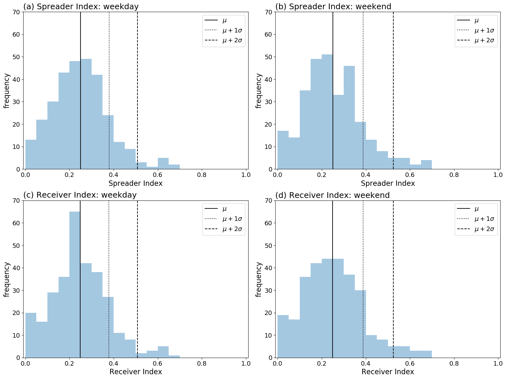
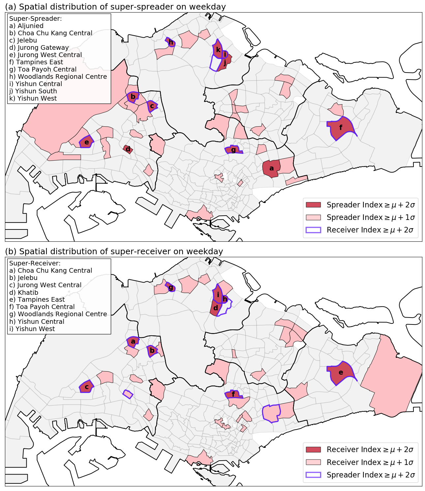

## Updated result section (part 4-5, figs 6-9)

#### Part 4: Spreader & receiver indexes

The calculation of spreader and receiver indexes required the local normalized in-degree and out-degree centralities, incoming and outgoing neighborhood zone-entropy and coreness-entropy. These six node (subzone) characteristics were range between zero and one. Figure 6 shows the local out- and in-degree (first column), the outgoing and incoming neighborhood zone-entropy (second column) and coreness entropy (third column) of the weekday  (first two rows) and weekend (the last two rows) flow network. The data in each row (three variables) were used to calculate either spreader index or receiver index. The spatial distribution showed that variables in the three columns were different. The high local weighted out- and in-degree were mostly concentrated at the East, West, and North East Regions; the high neighborhood zone entropy were mainly located at the North and Central Regions; most of the highest neighborhood coreness entropy subzones were at the North Region. In other words, most of the subzones contained high values of either one or two of the three variables; only those subzones with high values of the three variables were the super spreader or super receiver. 

 

Figure 6. The spatial distribution of the 6 variables of weekday (a-f) and weekend (g-l). 

The distribution for the spreader index ($SI$) and receiver index ($RI$) of each subzone in weekday and weekend were shown in Figure 7. All the four distributions showed bell shape pattern indicating normal distribution, with a mean at about 0.248 to 0.252 (solid lines), $\mu+1\sigma$ about 0.378 to 0.388 (dotted lines), and $\mu+2\sigma$ about 0.507 to 0.525 (dashed lines). The subzones that lay above the $\mu+2\sigma$ threshold were identified as super-spreader or super-receiver, which number were about: (a) 10 weekday super-spreader, (b) 13 weekend super-spreader, (c) 11 weekday super-receiver, and (d) 13 weekend super-receiver. The subzones that lay between $\mu+1\sigma$ and $\mu+2\sigma$ were categorized as secondary-spreader or secondary-receiver. 

 

Figure 7. The frequency distribution of the spreader index (a, b) on the first row, and receiver index (c, d) on the second row, for the two datasets: first column (a, c) for weekday, and second column (b, d) for weekend. The vertical solid lines indicated the mean of the distributions, and the vertical dashed lines showed the two times of standard deviation larger than the mean of the distributions. The subzones lie outside the dashed lines are the subzones with the highest spreader or receiver indexes, which were identified as the super-spreaders and super-receivers. 

#### Part 5: Super-spreader and super-receiver

The spatial distribution of the super-spreader (SS) and super-receiver (SR) were shown in Figure 8 for weekday, and in Figure 9 for weekend. In the weekday result (Figure 8), 11 subzones were identified as super-spreader (red colored with labels in Figure 8a, $SI\geq \mu+2 \sigma$); nine subzones were identifived as super-receiver (red colored with labels in Figure 8b, $RI\geq \mu+2 \sigma$); eight of them were overlapped as both super-spreader and super-receiver (red colored subzones with purple border). This indicated that most of the subzones with the highest spreader index would also had the highest receiver index, and vice versa. In Figure 8a, three subzones ((a) Aljunied, (d) Jurong Gateway, and (j) Yishun South, the red colored area without purple border) were identified as super-spreader, but not as super-receiver; two of them (a and d) were secondary receiver ($\mu+1\sigma \leq RI< \mu+2 \sigma$); Yishun South's $RI$ was less than $\mu+1\sigma$. In Figure 8b, one subzone ((d) Khatib) were identified as super-receiver but which spreader index was less than $\mu+1\sigma$. 

 

Figure 8. The spatial distribution of (a) spreader index ($SI$), and (b) receiver index ($RI$) for weekday. The subzones with purple border in (a) and (b) respectively indicate the super-receiver ($RI\geq \mu+2\sigma$) and super-spreader ($SI\geq \mu+2\sigma$). 

The weekend distribution result showed slightly different patterns. There were 12 subzones identified as super spreader on weekend. Nine of them were identified as super spreader on weekdays (c, e-l in Figure 9a), and the other three were secondary spreader (a, b, and d in Figure 9a); none of which were less than $\mu+1\sigma$ in the previous figure. Some of the weekday super spreader (a and j in Figure 8a) became secondary spreader on weekend. Similarly, all weekend super receiver on weekend were either super or secondary receiver on weekdays, and vice versa.  A total of 12 super receivers were found on weekend, 8 of which were overlap with weekday super receiver result (c-d and f-l in Figure 9b), the other four of which were promoted from weekday secondary receiver (a, b, c, and e in Figure 9b); one of the weekday super receiver became secondary receiver (a in Figure 8b). This situations indicated that the spreader indexes and receiver indexes were not dramatically change between weekday and weekend. The differences between spreader and receiver indexes were four subzones: Boulevard and Khatib (a and g in Figure 9b) were super receivers, but Khatib had a spreader index less than $\mu+1\sigma$, whereas Boulevard was a secondary spreader; Ang Mo Kio Town Centre and Choa Chu Kang Central (a and c in Figure 9a) were super spreaders, but they were only secondary spreader on weekend. 

 

Figure 9. The spatial distribution of (a) spreader index ($SI$), and (b) receiver index ($RI$) for weekend. The subzones with purple border in (a) and (b) respectively indicate the super-receiver ($RI\geq \mu + 2\sigma$) and super-spreader ($SI\geq \mu + 2\sigma$). 

Seven subzones (Jelebu, Jurong West Central, Tampines East, Toa Payoh Central, Woodlands Regional Centre, Yishun Central, and Yishun West) were identified as both SS and SR (in red) in both weekday and weekend. During weekday, most of the identified SS or SR area were the regional core area that contained a higher density of human activity. Tanpines East (d) and Aljunied (i) had a relatively large area. Although their residential population density were not among the highest population area in the country, they contained a main bus interchanges, multiple MRT stations, and several shopping malls. These places were the transport hubs, e.g. Tampines East contained an interchange of two MRT lines,  whereas Aljunied contained several MRT stations and near to a MRT interchange. Tampines East remained in SS and SR in weekend, while Aljunied became less important of the role as spreaders and receivers. Choa Chu Kang Central (a), Jelebu (b),  Jurong West Central (c), and Woodlands Regional Centre (f) were SS and SR on weekday and weekend. These places had a smaller area but high residential population density. Jurong Gateway (j on weekday and d for weekend) was a small subzone with a low amount of population, but it was a SS on weekday and both SS and SR on weekend. This may because it contained the Jurong East MRT station, a large bus interchange, and several shopping malls, which made it a core of daily activity with large intensity of population interactions. 

One counter intuitive result was shown from Figure 8 and 9, which is the central business districts  (CBD) contain less SS and SR as expected. The CBD of Singapore was located at the central part of the Central Region. Those areas had a high density of human activity. As shown in Figure 7, most of the subzones in CBD had either low weighted degree, neighborhood zone-entropy, or neighborhood coreness-entropy. The low weighted degree probably cause by the area were small, which limited the catchment of incoming or outgoing flows; the low zone-entropy was caused by the majority of the people were circulating within the CBD, which subzones were mainly in the same zone (zone 2 in weekday and zone 1 in weekend, Figure 4); the low coreness entropy was caused by the majority of the flows were moving to or from the subzones in CBD, which were mainly composed by the core area (Figure 5). This result indicates that the CBD work places were less influential in terms of quickly spreading the disease to the rest of the country, but they would be quickly spread inside CBD area as a consequence of the strong flows within the CBD. The more influential area were the regional transport hubs, which were near to the residential areas. 