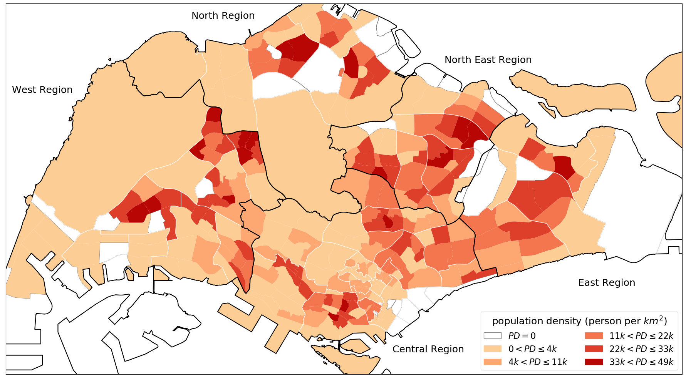
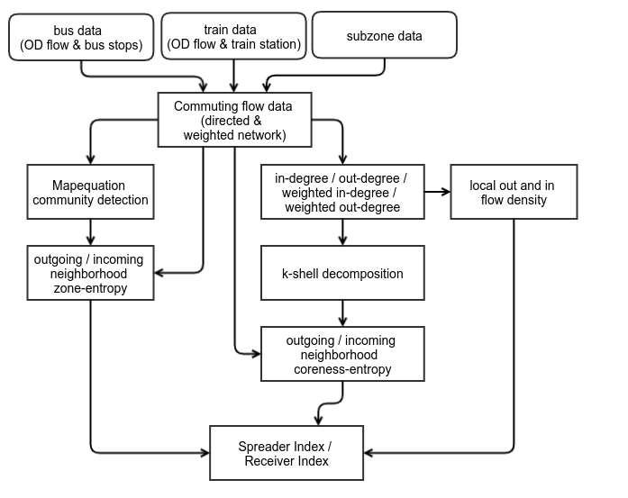
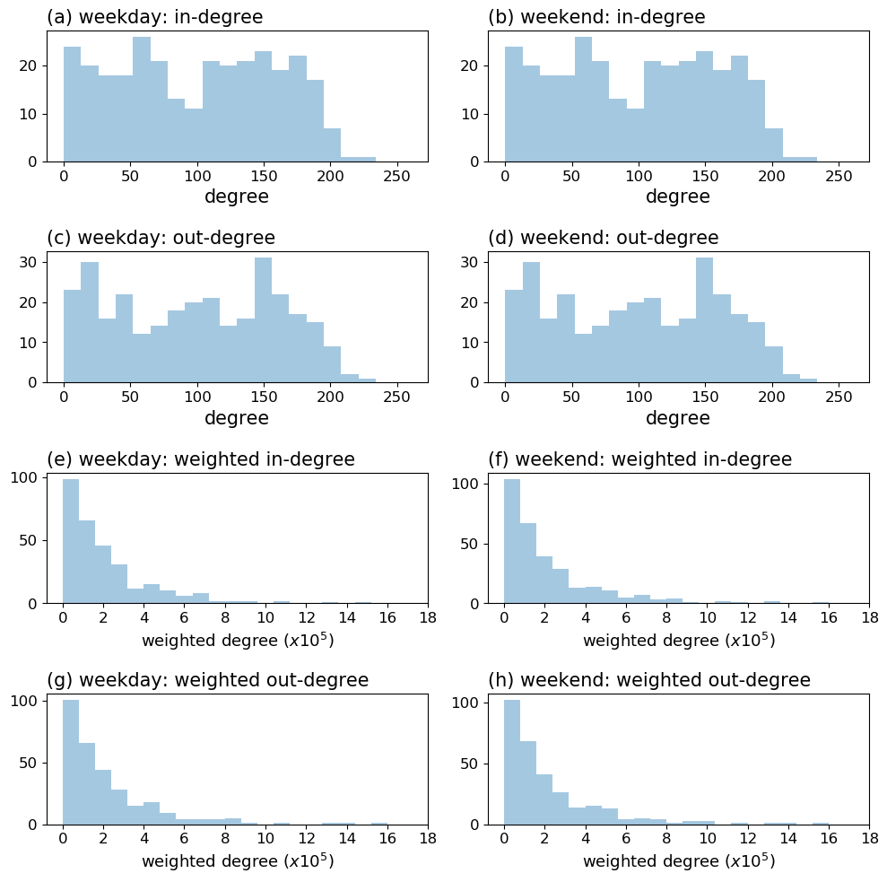
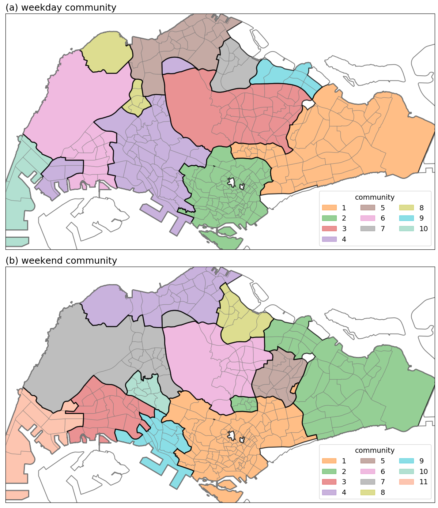
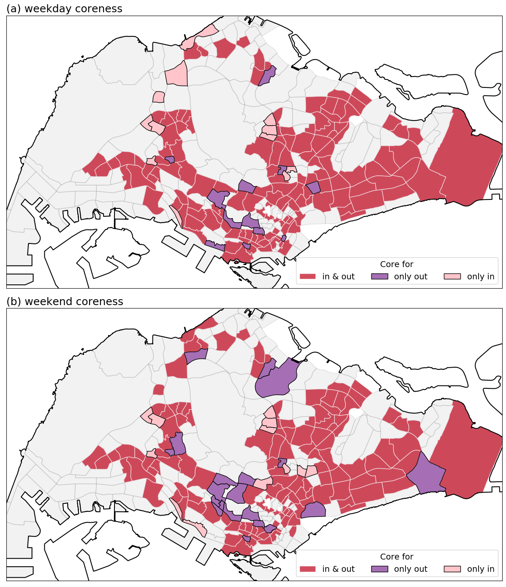
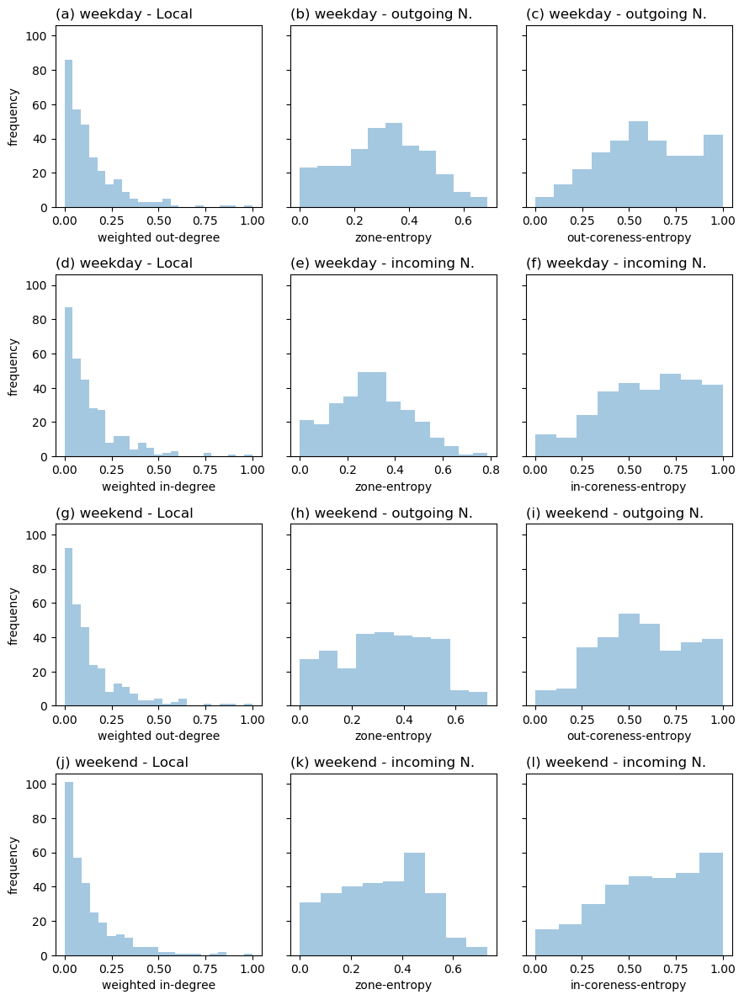
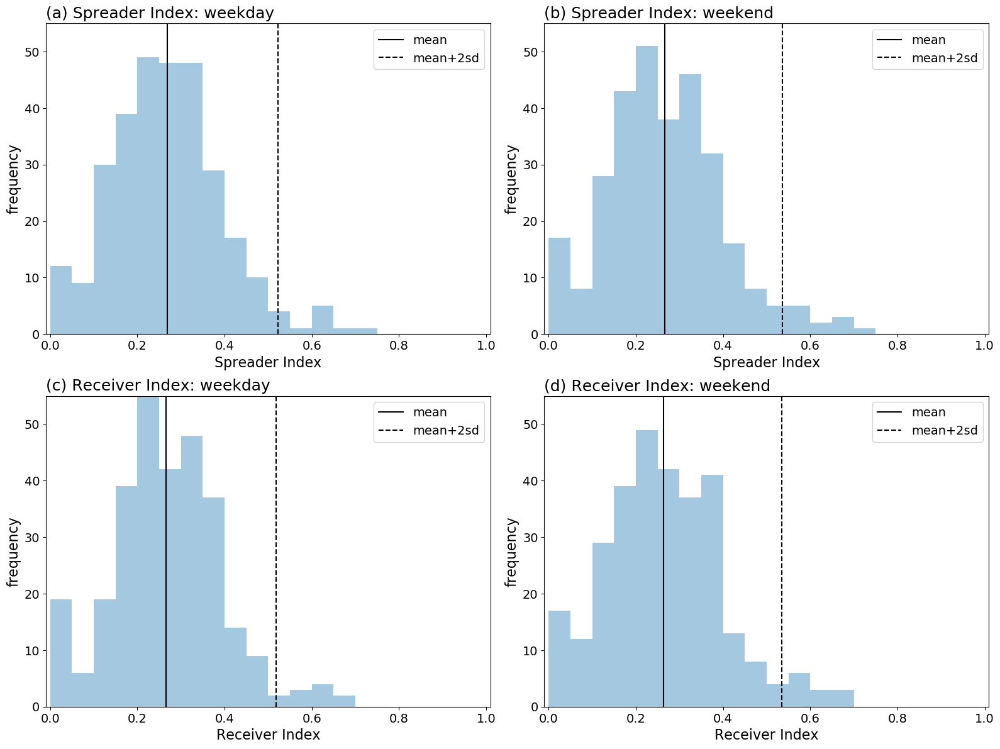
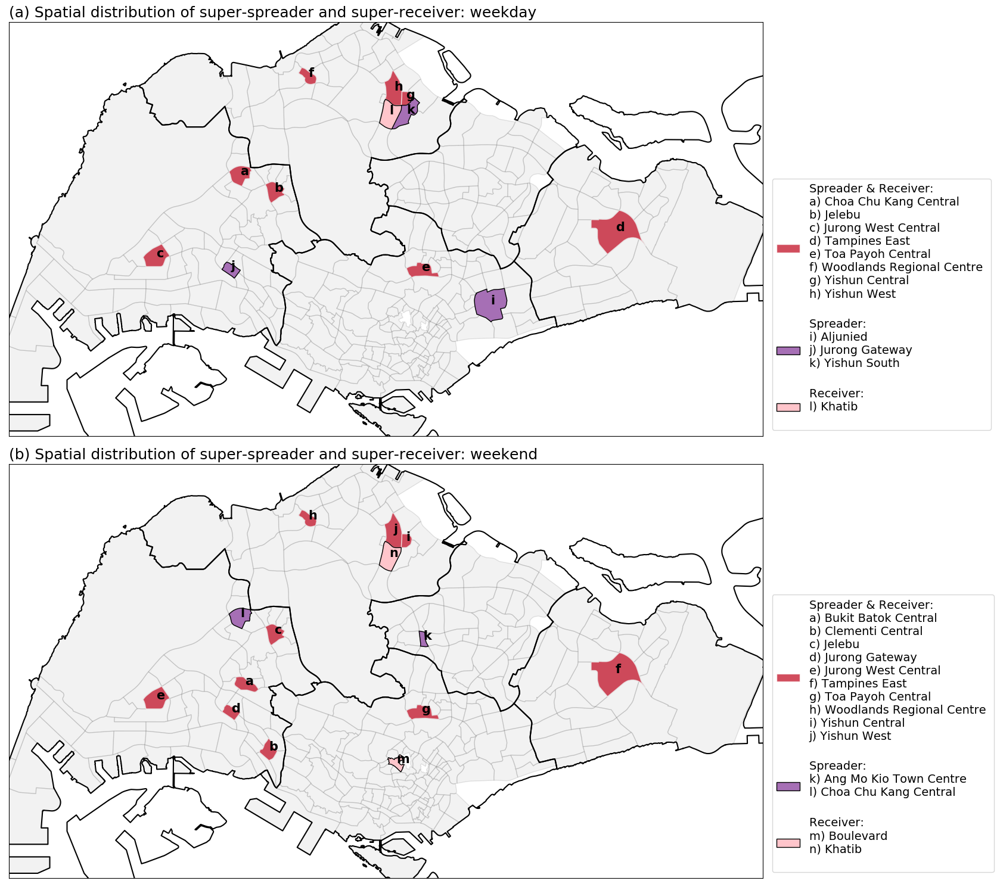

## Identifying spatial super-spreader and super-receiver in commuting network of Singapore. 

*current status*: report

## Introduction

When a new infectious disease strikes a country or a city, the local public health sector authority would need to prevent the spreading of the disease and contain the outbreak situation. A infectious disease which could transmit from human to human, its spreading happens when people closely interact with one another, therefore the people are advise to not oppose themselves in a public space with high density of people, and not to attend or held activities with a large amount of people. 

But, before reaching the city/country lock-down condition, the peoples are still need to go to work or school as usual. In other words, the commuting process would happen as usual. When the commuting process is still working, it indicates the interactions between people would happens and if there is some unidentified patients or infected but asymptomatic persons in the crowds, the spreading of the disease may still occur. In most cases, the government authorities would try to control the disease situation by monitoring the health-care system (sick person is advised to go to doctors) and monitoring the incoming travelers from the airports or checkpoints. From the perspective of spatial governance, it is also important to knows that which part of the city is more vulnerable or has the capability to spread the disease in a short time period; those places should get more attentions in terms of local monitoring and resource allocations. 

The commuting flow of a city is a network representation of people flow in a city. A commuting flow network connect two places with a number indicating the number of people move from the origin to the destination. It could be used to capture the flow of people between places, and also the location where the interaction of people occurs. Therefore, the commuting flow network could be used to identify the places that are more dangerous in terms of spreading disease, namely super-spreader; and the vulnerable places that is easier to get infected, namely super-receiver. 

The aim of this study is to identify the super-spreader and super-receiver in a commuting network. A spatial super-spreader is a location where a lot of people are moving from, and those people are moving to different places; a spatial super-receiver is the destination of a large number of commuters, who come from different places. In other words, there is two keys to identify super-spreader and super-receiver, which is local density and neighborhood diversity. The local densities  of a location are the number of people leaving from or reaching to the location. The neighborhood diversities contains two type of diversity, one of which is the diversity of zones, i.e. are the people come from different parts of the country; another is the diversity of coreness, i.e. are the people come from different types of the country in terms of core or peripheral areas. 

In this study, we present the analysis of Singapore public transport flow network, and identify the spatial super-spreaders and super-receivers using the spreader and receiver indexes, which were calculated based on the local densities and neighborhood diversities measurements. The population flow pattern may be different for weekday and weekend. Thus, the flow data were separated into two parts, weekday and weekend, to show the differences of super-spreaders and super receivers during weekdays and weekends. 

## Methods

The section contain three parts: (a) brief description of the study area, (b) the flow data, and (c) the four steps calculation of the spreader-index and receiver index. 

### Study area

This study focused on the Singapore commuting network flow in Singapore, using the subzone level spatial boundaries (from Master Plan 2014) as the analysis unit. The residential population density were shown in figure 1. There were five regions (Central, West, North, North East, and East), 55 planning areas, and 323 subzones. Some of the subzones contain no residential population (white areas), which includes airports and airbases (e.g. Changi Airport at the East Region) and industrial parks or ports (e.g. Jurong Island and Bukom at the south of the West Region, and Simpang North and South at the North Region). Although these places contain zero residential population, they were the work places (destinations) of a lot of commuters. 

Figure 1. The subzone residential population density map of Singapore. 

### Flow Data

We used the origin-destination (OD) riderships data of train and bus to create a public transport commuting network. The OD riderships data were collected from the Singapore Land Transport Authority (LTA) through API calls. In this study, we used the riderships data of January 2020. The OD riderships data contains the hourly passenger flows between each pair of train stations and bus stops, and is aggregated into weekday (23 days) or weekend (8 days). 

As the raw data records the flow between bus stops or train stations, we spatially aggregated the data into subzones to subzones flow, according to the bus stops or train stations locations. A total of 303 subzones contains at least one bus stop or one train station. These subzones were used as the nodes (303 nodes) in the commuting network, with the flows between them as the directed and weighted edges (a total of 30331 edges, of which 288 are self-loops and 30043 are inter-subzones edges). 

### Calculation framework

the framework

Figure 2. The calculation flow chart of the spreader and receiver index.

#### Step 1: Degree centralities

#### Step 2: Zone-entropy

#### Step 3: Coreness-entropy

#### Step 4: Spreader & receiver index

## Results

#### Degree centralities

Figure 3. The frequency distribution of the degree centralities: first column (a, c, e, g) showed the distribution for weekday dataset, second column (b, d, f, h) showed the distribution for weekend dataset; first row (a, b) showed the non-weighted in-degree, second row (c, d) showed the non-weighted out-degree, third row (e, f) showed the weighted in-degree, and forth row (g, h) showed the weighted out-degree. 

#### Community detection

Figure 4. The detected communities for (a) weekday flow data and (b) weekend flow data. The colors indicates the communities. 

#### Coreness

Figure 5. The coreness of for (a) weekday flow data and (b) weekend flow data. Red color area showed the subzones which were identified as core area for both incoming and outgoing direction, purple color area showed the outgoing core subzones, and pink color showed the incoming core subzones.

#### Spreader & receiver index

Figure 6. The frequency distributions of the six variables for the two datasets: (a-f) weekday and (g-l) weekend. (a, g) showed the local weighted out-degree, (b, h) showed the zone-entropy of the outgoing neighbors, (c, i) showed the outgoing-coreness-entropy of the outgoing neighbors; the three variable were used to calculate the spreader index. (d, j) showed the local weighted in-degree, (e, k) showed the zone-entropy of the incoming neighbors, (f, l) showed the incoming-coreness-entropy of the incoming neighbors; the three variables were used to calculate the receiver index. 

Figure 7. The frequency distribution of the spreader index (a, b) on the first row, and receiver index (c, d) on the second row, for the two datasets: first column (a, c) for weekday, and second column (b, d) for weekend. The vertical solid lines indicated the mean of the distributions, and the vertical dashed lines showed the two times of standard deviation larger than the mean of the distributions. The subzones lie outside the dashed lines are the subzones with the highest spreader or receiver indexes, which were identified as the super-spreaders and super-receivers. 

#### Super-spreader and super-receiver

Figure 8. The map of the super-spreader and super receiver for: (a) weekday, (b) weekend. The red patches indicated that the subzones were both super-spreader and super-receiver; the purple patches were the super-spreaders; the pink patches were the super receivers. 

## Discussions and conclusion

*core contribution of this study*

This study used 

*limitations*

1. This study covered only the public transportation commuters, specifically, only bus and train riderships were included. Other ways of transportation, including the private or hired automobiles (cars, motorcycles, shuttle buses or vans), and active transportation (by walking, bicycles, skateboards, scooters, etc.) were not included. 
2. Cross-border flows were not included. Many workers in Singapore come from Malaysia and commute in a daily basis. There are some bus services connecting stations in Johor Bahru, Malaysia and various places in Singapore (Woodlands, Jurong East etc.). The in/out flows of these places in Singapore would be underestimated. 

